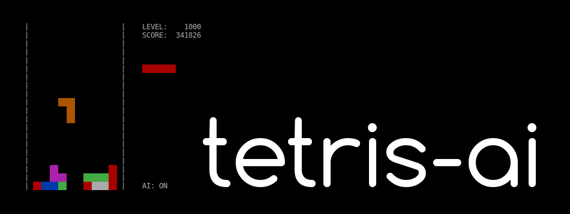

>Did you know that Alexey Pajitnov, the original Tetris designer, derived the games name from the Greek numerical tetra (four) and tennis, his favorite sport?

## This Version

The exciting thing about this version is the implemented AI, which can play the game better (primarily a lot faster) than any human. I let it run until it hit one million cleared lines, so i assume that it can play forever.

The AI chooses for a new Tetronimo the best of all the possible positions the latter can take in by evaluating each one of the resulting boards based on weighted values (e.g. added height of all comumns) and finally choosing the one that yields the best score. I calculated the weights using a genetic algorithm, which can also be found in the source code.

This program runs on Linux using the Curses module. Start the game by running `python3 tetris.py` in your terminal.

## Controls

Key | Function
----|---------
⇧   | turn clockwise
⇦   | move to the left
⇨   | move to the right
⇩   | move one block down
↵   | move all the way down
Q   | quit game
A   | switch AI on/off

